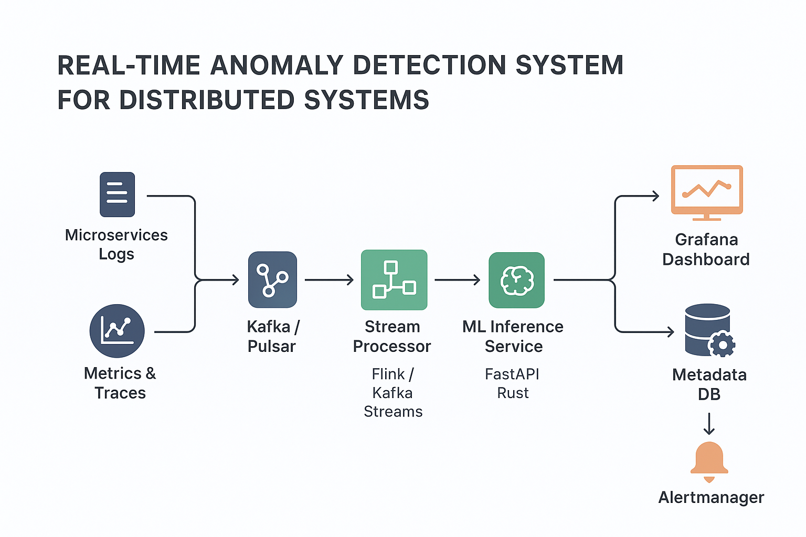

# 📡 Real-time Anomaly Detection for Distributed Systems  

  
  

An end-to-end, containerized observability + ML pipeline that ingests live system metrics, detects anomalies in real time using a self-training Autoencoder, and visualizes results via Grafana dashboards.  

Built with **Go, Python, Kafka, PyTorch, Prometheus, PostgreSQL, and Docker**.  

---

## 🚀 Key Highlights  

- **Dual-Pipeline Architecture** → Metrics flow into both Prometheus (live monitoring) and Kafka (stream analysis).  
- **Automated MLOps Workflow** → Auto-collects data, trains a PyTorch Autoencoder, calibrates thresholds, and persists artifacts.  
- **Multi-Variate Detection** → Monitors **7 system metrics** (CPU, memory, load, disk I/O, network I/O).  
- **Persistent Storage** → Anomalies stored in PostgreSQL.  
- **Pre-Provisioned Dashboard** → Grafana automatically bootstrapped with dashboards + data sources.  
- **Stress-Test Ready** → Generate CPU spikes via `stress-ng` and watch real-time anomaly detection kick in.  

---

## 🏗️ Architecture  

The system is structured as **three microservices** running in Docker Compose:  

1. **Metrics Collector (Go)** – Collects host metrics with `gopsutil`, exposes Prometheus endpoint, and streams to Kafka.  
2. **Processor (Go)** – Consumes Kafka data, builds time windows, sends batches to ML service.  
3. **ML Analyzer (Python + FastAPI)** – Autoencoder inference + training loop with artifact persistence.  

Anomalies → PostgreSQL → Grafana visualization.  

<p align="center">  
    
</p>  

---

## ⚙️ Tech Stack  

- **Data Collection:** Go (`gopsutil`)  
- **Streaming:** Apache Kafka  
- **Processing:** Go  
- **ML Service:** Python (FastAPI, PyTorch)  
- **Database:** PostgreSQL  
- **Monitoring:** Prometheus  
- **Visualization:** Grafana  
- **Infra/Orchestration:** Docker Compose  

---

## 📦 Quickstart  

```bash
# 1. Clone the repo
git clone https://github.com/atiwari-0/anomaly-detection.git
cd anomaly-detection

# 2. Launch full system
docker compose up --build -d

# 3. Monitor training logs
docker compose logs -f ml-analyzer
```

### Access Services  
- **Grafana Dashboard:** http://localhost:3000 (user: `admin`, pass: `admin`)  
- **Prometheus:** http://localhost:9090  

---

## 🧪 Testing Anomalies  

```bash
# Install stress-ng
sudo apt-get install stress-ng

# Apply CPU stress for 1 minute
stress-ng --cpu 1 --timeout 60s
```

➡ Grafana will display a red anomaly marker during the spike. Event also logged in PostgreSQL.  

---

## 📂 Project Structure  

```
.
├── infra/                # Infra configs (Grafana, Prometheus)
├── services/             # Microservices
│   ├── metrics-collector # Go collector
│   ├── processor         # Go stream processor
│   └── ml-analyzer       # Python ML service
└── docker-compose.yml    # Orchestration
```

---

## 📜 License  
MIT  
